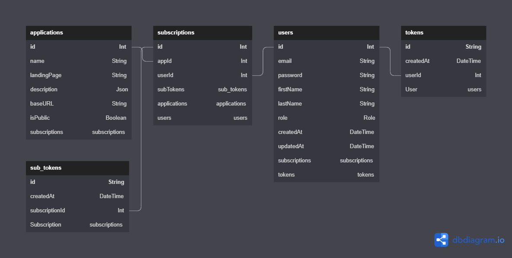

<p align="center">
  <a href="http://nestjs.com/" target="blank"></a>
</p>

## Description

[Nest](https://github.com/nestjs/nest) framework TypeScript starter repository.

## Installation

```bash
$ npm install
```

## Running the app

```bash
# development
$ npm run start

# watch mode
$ npm run start:dev

# production mode
$ npm run start:prod
```

## Test

```bash
# unit tests
$ npm run test

# e2e tests
$ npm run test:e2e

# test coverage
$ npm run test:cov
```

## Database



```plaintext
Project ms_users {
  database_type: 'PostgreSQL'
}

Table USERS {
  id int [pk, increment] // auto-increment
  email varchar [not null, unique]
  password varchar [null]
  admin boolean [default: false]
}

Table APPLICATION {
  id int [pk, increment]
  name varchar [not null, unique]
  url varchar [null]
}

Table SUBSCRIPTION {
  id int [pk, increment]
  user_id varchar [not null, ref: > USERS.id]
  app_id varchar  [not null, ref: > APPLICATION.id]
}
```

You can see the associated **pgsql** commands at the following files : *prisma\ms-users.sql*

## Architecture of the code 

| Folder                   | Purpose                                                      |
| ------------------------ | ------------------------------------------------------------ |
| `app.controller.ts`      | A basic controller with a single route.                      |
| `app.controller.spec.ts` | The unit tests for the controller.                           |
| `app.module.ts`          | The root module of the application.                          |
| `app.service.ts`         | A basic service with a single method.                        |
| `main.ts`                | The entry file of the application which uses the core function `NestFactory` to create a Nest application instance. |

For nestJS project, in general : 
+ **Modules:** used to organize the code and split features into logical reusable units. Grouped TypeScript files are decorated with “@Module” decorator which provides metadata that NestJs makes use of to organize the application structure.
+ **Providers:** also called services, which are designed to abstract any form of complexity and logic. Providers can be created and injected into controllers or other providers.
+ **Controllers:** responsible for handling incoming requests and returning appropriate responses to the client-side of the application (for example call to the API).

## API documentation

http://localhost:3000/api

